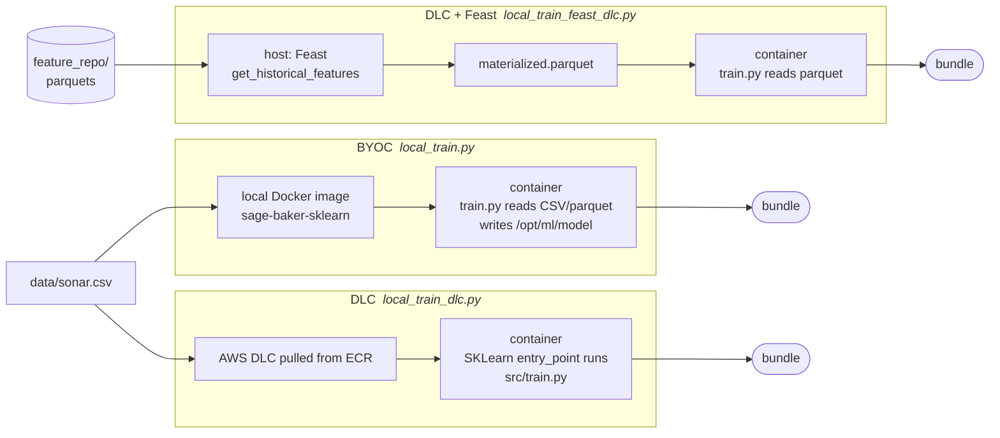
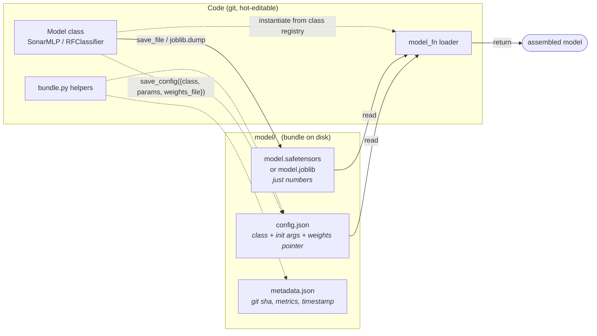
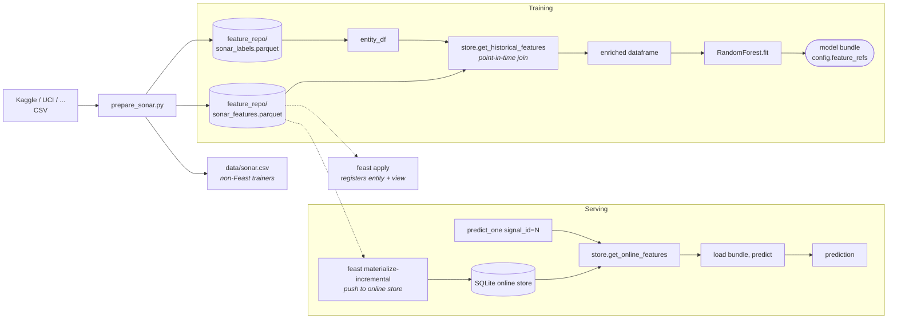

# sage-baker

Local SageMaker training sandbox using **SageMaker Local Mode**, with two
interchangeable paths: a **bring-your-own-container (BYOC)** image for fully
offline use, and the **AWS Deep Learning Container (DLC)** image for
production-parity workflows.

## What this is

SageMaker has a "Local Mode" where the SDK runs training/inference jobs in
Docker containers on your machine using the same `/opt/ml/...` directory
contracts as real SageMaker. By default it pulls Deep Learning Container
(DLC) images from a regional ECR registry, which requires real AWS credentials
(any account works — the images are public-read, but ECR still demands a real
auth token to issue the pull).

This project supports both:

- **BYOC** (`local_train.py`) — small local image, follows the algorithm
  container contract (a `train` command on `PATH` reading `/opt/ml/input/`
  and writing `/opt/ml/model/`). Fully offline. No AWS account needed.
- **DLC** (`local_train_dlc.py`) — official AWS scikit-learn DLC image.
  Requires real AWS creds for the initial ECR pull; runs locally after that.
  Uses the `entry_point` + `source_dir` flow, so edits to `train.py` don't
  require any rebuild.

## Repo layout

```
Dockerfile             minimal Python + scikit-learn image with a `train` command (BYOC)
src/bundle.py          generic helpers for the standard model-bundle layout
src/tracking.py        opt-in MLflow tracking helpers (no-op when unconfigured)
src/train.py           sklearn training example — bundle layout, model_fn
src/train_torch.py     torch training example — same bundle layout, safetensors weights
src/train_feast.py     sklearn trainer pulling features via Feast (point-in-time join)
feature_repo/          Feast feature definitions (entities.py, features.py, store.yaml)
prepare_data.py        writes data/iris.csv (toy multiclass dataset)
prepare_sonar.py       writes data/sonar.csv + Feast parquets (Sonar Rocks vs Mines)
local_train.py         BYOC driver — uses the local image, no AWS account
local_train_dlc.py     DLC driver  — uses the AWS scikit-learn DLC image
local_train_feast_dlc.py DLC + Feast — host-side feature retrieval, container trains
local_serve.py         placeholder — does not work yet (see "Serving", below)
requirements.txt       sagemaker<3, boto3, mlflow, scikit-learn, pandas, docker
requirements-torch.txt opt-in extras for the torch example: torch, safetensors
requirements-feast.txt opt-in extras for the Feast feature-store example
```

The training script lives in `src/` so the DLC's `source_dir` can point at a
clean directory containing only training code. SageMaker auto-`pip install`s
any `requirements.txt` inside `source_dir`; if the project's outer
`requirements.txt` (sagemaker, boto3, etc.) leaks into the container it
upgrades numpy and binary-incompatibilizes the pre-installed sklearn/pandas.
Don't put a `requirements.txt` inside `src/` unless you genuinely need extra
deps in the training container.

The training script follows SageMaker conventions:

| Path                                          | Purpose                              |
| --------------------------------------------- | ------------------------------------ |
| `/opt/ml/input/data/<channel>/`               | Input data (mounted per channel)     |
| `/opt/ml/input/config/hyperparameters.json`   | Hyperparameters (string-typed)       |
| `/opt/ml/model/`                              | Where the model is written           |
| `/opt/ml/output/`                             | Where failure outputs go             |

## Setup

Requirements: Docker, Python 3.10+, ~1 GB free disk.

```bash
python3 -m venv .venv
.venv/bin/pip install -r requirements.txt
```

## Running training

Generate a dataset (pick one — each script wipes `data/` and writes one CSV):

```bash
.venv/bin/python prepare_data.py    # iris (3-class, 150 rows)
# or
.venv/bin/python prepare_sonar.py   # Rocks vs Mines (binary, 208 rows)
```

`train.py` reads whichever CSV is in the train channel — no code changes
needed to swap datasets, as long as the CSV has a `target` column.

### BYOC (offline)

```bash
docker build -t sage-baker-sklearn:latest .
.venv/bin/python local_train.py
```

### DLC (with AWS credentials)

AWS now recommends IAM Identity Center (SSO) with short-lived credentials
over long-lived access keys. One-time setup:

```bash
aws configure sso                 # creates a profile entry in ~/.aws/config
```

Then before each session:

```bash
aws sso login --profile your-profile
export AWS_PROFILE=your-profile
.venv/bin/python local_train_dlc.py
```

(Long-lived `AWS_ACCESS_KEY_ID` / `AWS_SECRET_ACCESS_KEY` env vars still work
if you need them.)

The DLC image (~3 GB) is pulled once and cached in your local Docker daemon;
subsequent runs are offline.

Both paths produce the same shape of output:

```
algo-1-XXXX  | validation_accuracy=1.0000
algo-1-XXXX exited with code 0
model artifact: file:///.../sage-baker/.sm-scratch/.../compressed_artifacts/model.tar.gz
```

The model artifact (`model.tar.gz` containing `model.joblib`) lives under
`.sm-scratch/`.

## Training paths at a glance



All three paths converge on the same `model_dir/` bundle layout — the
`model_fn(model_dir)` loader doesn't care which path produced it.

## When to use which

| Use BYOC when …                              | Use DLC when …                              |
| -------------------------------------------- | ------------------------------------------- |
| no AWS credentials available                 | you have any AWS account                    |
| you want a small (~200 MB) image             | image size doesn't matter                   |
| deps are simple (sklearn / pandas / etc.)    | you want AWS-tested framework + GPU stack   |
| training script is stable                    | you want to iterate on `train.py` fast      |
| serving doesn't matter                       | you want `/ping` + `/invocations` for free  |

The big practical wins of DLC are the `entry_point` flow (no rebuilds on
script edits) and the inference toolkit (working serving in one `.deploy()`
call). BYOC's wins are zero AWS dependency and a small, fully-controlled
image.

## Architecture: separating code from weights

The single most important design decision in a training system is **what
gets persisted with the model and what stays in code**. Pickle (and
`torch.save(model, ...)`, and the default `mlflow.<flavor>.log_model`)
freezes the running Python object — including a reference to the class
that defined it. When the class moves, gets renamed, or has a method
added, unpickling either explodes or silently loads the wrong thing. This
is the trap where every code change forces a retrain.

The fix is a layered model: **code in git, weights as data, config as JSON.**

There is no single industry-standard format for this; the closest thing is
HuggingFace's `save_pretrained` / `from_pretrained` (which writes
`config.json` + `model.safetensors` + tokenizer files), and the layout in
this repo is an extension of that idea. MLflow's "MLmodel" format, TF's
SavedModel, TorchServe's `.mar`, and ONNX are all alternatives at different
abstraction levels — none of them solve the code/weights coupling problem
unless you opt out of their default flavors.



### Bundle layout

The training script writes a directory with this shape, regardless of
framework:

```
model/
├── config.json           how to build the model (arch, hyperparams,
│                         weights_file pointer, feature schema)
├── <weights_file>        the actual numbers (model.joblib, model.safetensors, …)
├── preprocessor.json     [optional] preprocessor state (scaler stats,
│                         label maps, vocab refs)
└── metadata.json         provenance: timestamp, python version, git sha,
                          training metrics
```

`config.json` knows the name of the weights file. The loader reads the
config, instantiates the model class with those args, and loads weights
from the file the config points at. The class definition lives in your
repo — versioned, debuggable, hot-editable. Want to fix a bug in
`forward()`? Edit, reload weights, done. No retrain.

### Format choices

| Thing                          | Format                                       |
| ------------------------------ | -------------------------------------------- |
| Torch / JAX / TF tensors       | **`safetensors`** (mmap, no pickle, no RCE)  |
| Embeddings (raw arrays)        | safetensors or `.npz`                        |
| Tokenizers, HF models          | `tokenizer.save_pretrained(dir)`             |
| HF model end-to-end            | `model.save_pretrained(dir)` — already does the layout above |
| Hyperparameters / model config | JSON                                         |
| sklearn pipelines              | `joblib` (pickle) is least-bad — pin `scikit-learn==X.Y` and accept it. For *important* models, extract coefficients / tree structures into JSON manually. |

`safetensors` is the boring-good default for tensor data: zero-copy mmap,
no arbitrary code execution on load, supported by torch / JAX / TF / HF.

### Beyond pickle: alternatives by framework

The boring defaults above (joblib, safetensors, JSON) are the right
starting point. When they aren't enough — most often when you want
stricter security, version-decoupling, or framework-portability —
here's what to reach for.

#### sklearn

`joblib` is canonical for sklearn pipelines, but it *is* pickle under
the hood. Two real risks live here:

1. **Framework-version coupling.** Tree node formats, parameter
   layouts, and class names change across sklearn versions and can
   silently corrupt loads. We hit this live in this repo: a model
   trained with sklearn 1.2 in the DLC failed to load with sklearn
   1.3 on the host —
   `ValueError: node array from the pickle has an incompatible dtype`.
   The `framework_version` field in `config.json` is the warning
   signal. Mitigation: lock the trainer's sklearn version to the
   inference container's.
2. **Arbitrary code execution on load.** Pickle deserializes by
   importing classes and calling their constructors. A malicious pkl
   from an untrusted source = remote code execution.

Alternatives:

- **`skops`** — sklearn-team-blessed safer pickle. `skops.io.dump` /
  `skops.io.load` use an explicit allowlist of trusted classes and
  refuse anything else, fixing the RCE risk. Same shape as joblib;
  trivial drop-in. **Doesn't fix the version-coupling problem** — the
  underlying object format is still sklearn's.
- **`skl2onnx`** — converts a fitted sklearn pipeline to ONNX. The
  resulting graph loads in ONNX Runtime without sklearn at all, fully
  decoupled from sklearn versions and from pickle. Cost: not every
  sklearn estimator has an ONNX path, and you lose sklearn-specific
  introspection (`feature_importances_`, `decision_function`, etc.).

#### torch

For weights-only, `safetensors`. For "model in a box" — graph + weights,
loadable without the Python class — there are two mainstream paths:

- **TorchScript** (`torch.jit.script` or `torch.jit.trace` → `.pt`):
  serializes the forward graph alongside weights. The class definition
  isn't needed at load time. Tradeoff: only a JIT-compatible subset of
  Python works — you have to type-annotate (`script`) or write a
  trace-friendly forward (`trace`). Mature; common in mobile.
- **`torch.onnx.export`**: emits ONNX. Maximally portable — runs in
  ONNX Runtime (C++), TensorFlow.js, etc. Cost: not every torch
  operator maps to an ONNX op; you sometimes refactor the model to get
  a clean export.

#### Framework-agnostic

- **ONNX** (Open Neural Network Exchange) — the strongest answer to
  "I want the model independent of the training framework." Stores the
  computation graph + weights as protobuf. Visually inspectable with
  Netron. Loadable from C++ / Python / JS / Rust without requiring
  torch / TF / sklearn. Best when you need to serve in non-Python
  environments or want hard separation from training code.
- **TF SavedModel** — TF-specific but mature: graph + weights +
  signatures in a directory. Less relevant unless you're on TF.

In this bundle layout, you can swap the *weights file format* without
changing the bundle envelope: `weights_file: "model.onnx"` is just as
valid as `model.joblib` or `model.safetensors`. `model_fn(model_dir)`
reads `config.json` to know which loader to use. The code/weights/config
separation holds regardless of which weights serializer you pick.

### How this maps to other systems

- **SageMaker.** Whatever you put in `/opt/ml/model/` gets tarred to
  `model.tar.gz`. Write the bundle there during training; the inference
  container's `model_fn(model_dir)` calls your `load(model_dir)` to
  reassemble. Same function, two consumers.
- **MLflow.** Two clean paths. Either treat MLflow as tracking only and
  use `mlflow.log_artifacts("model/")` to log the bundle as opaque files —
  load via your own `load(dir)`, never `mlflow.X.load_model`. Or wrap
  `load(dir)` in a custom `mlflow.pyfunc.PythonModel` so
  `mlflow.pyfunc.load_model(uri)` does the right thing. The point is to
  never let MLflow pickle your class.
- **Plain `pickle` / `torch.save(model, ...)` / `mlflow.X.log_model`.**
  These are exactly what we're avoiding. They can't survive code changes
  and they're a remote-code-execution hazard on load.

### How this maps to MLflow

Two clean ways to use the bundle layout with MLflow tracking:

```python
# 1. MLflow as tracking only — log the bundle as opaque artifacts.
mlflow.log_artifacts("model/")
# Loading: mlflow.artifacts.download_artifacts(...) then call your load(dir).

# 2. Custom PyFunc — wrap bundle.load in mlflow.pyfunc.PythonModel.
class BundleModel(mlflow.pyfunc.PythonModel):
    def load_context(self, context):
        self.model = your_load_fn(context.artifacts["bundle"])
    def predict(self, context, model_input):
        return self.model.predict(model_input)

mlflow.pyfunc.log_model(
    artifact_path="model",
    python_model=BundleModel(),
    artifacts={"bundle": "model/"},
)
# Loading: mlflow.pyfunc.load_model(uri) — uses your loader, not pickle.
```

Either way, MLflow never touches your model class.

### What's in this repo

- `src/bundle.py` — generic JSON helpers (`save_config`, `load_config`,
  `save_metadata`, `load_metadata`). Framework-agnostic.
- `src/train.py` — sklearn example. Trains a `RandomForest`, writes the
  bundle via `bundle.py`, exposes `model_fn(model_dir)`. Weights stored
  as `model.joblib`.
- `src/train_torch.py` — torch example. Trains an MLP, writes the *same*
  bundle layout via `bundle.py`, exposes the *same* `model_fn(model_dir)`
  shape. Weights stored as `model.safetensors`. Run standalone with
  `python src/train_torch.py --train ./data --model-dir ./model_torch`
  (install deps via `pip install -r requirements-torch.txt` first).

The two trainers prove the point: the `model_fn(model_dir) -> model`
contract is identical across frameworks. The weights file format and the
class definition differ; the bundle envelope and the loader signature do
not. To add a new framework, drop another `src/train_<x>.py` that calls
the same `bundle.save_config(...)` / `bundle.save_metadata(...)` and
writes its weights with whatever format that framework prefers.

## Tracking with MLflow

The trainers call MLflow unconditionally via `src/tracking.py`, which
no-ops when `MLFLOW_TRACKING_URI` is unset. Set the env var to enable
logging — params, metrics, tags, and the full bundle dir are all captured.

Quickstart with a local SQLite-backed server (the file-based backend is
deprecated as of MLflow 3 — use SQLite even for trivial local use):

```bash
# terminal 1: start a local server
.venv/bin/mlflow server --host 127.0.0.1 --port 5000 \
    --backend-store-uri sqlite:///mlflow.db \
    --default-artifact-root ./mlartifacts

# terminal 2: train
export MLFLOW_TRACKING_URI=http://127.0.0.1:5000
.venv/bin/python src/train_torch.py --train ./data --model-dir ./model_torch
.venv/bin/python local_train.py     # BYOC — see "Inside docker" below

# browse runs in the UI
open http://127.0.0.1:5000
```

What gets logged:

- **Params** — hyperparameters, dataset filename
- **Metrics** — validation accuracy; per-epoch train_loss for torch
- **Tags** — `framework=sklearn|torch`, plus MLflow's auto-tags (git commit, source)
- **Artifacts** — the entire bundle dir (`config.json`, `metadata.json`,
  weights file). Loading happens via `model_fn(model_dir)`, never via
  `mlflow.X.load_model` — so MLflow doesn't pickle your class.

### Inside docker (BYOC / DLC)

The drivers (`local_train.py`, `local_train_dlc.py`) automatically pass
`MLFLOW_TRACKING_URI` through to the container if it's set on the host,
rewriting `localhost` / `127.0.0.1` to `host.docker.internal` so the
container can reach the host. This works out of the box on Mac and
Windows.

**Linux limitation.** Docker for Linux does *not* resolve
`host.docker.internal` by default (it's a Mac/Windows convenience). For
container-side MLflow logging on Linux you also need:

1. Bind the server to all interfaces:
   `mlflow server --host 0.0.0.0 --port 5000 ...`
2. Tell the trainer to use the host's LAN IP instead — set
   `MLFLOW_TRACKING_URI=http://<your-lan-ip>:5000` (find with
   `hostname -I | awk '{print $1}'`) before running the driver.

Both of those are external-config tweaks, not code changes here. For now
the simplest workflow on Linux is to log MLflow runs from host-side
trainer invocations (`python src/train_torch.py ...`) and use the BYOC
container only for testing the SageMaker-deployment-shaped path.

For a remote MLflow server (e.g. company's), no rewrite happens — the
driver passes the URL through unchanged.

## Feature store: Feast prototype

Feast solves three real problems training pipelines tend to botch:
**training/serving skew** (same feature computed differently in batch and
at inference), **point-in-time correctness** (joining features without
leaking future data into past examples), and **reusability** (define
features once, consume from many models).

This prototype runs entirely on free local components — SQLite + parquet
files — and translates to a SageMaker workflow by swapping backends:

| Component       | Local (here)            | SageMaker / production       |
| --------------- | ----------------------- | ---------------------------- |
| Offline store   | parquet files           | S3 (just change `path:` in `FileSource`) |
| Online store    | SQLite                  | Postgres on RDS, Redis on ElastiCache (~$15/mo each) |
| Registry        | local sqlite file       | S3 file or Postgres          |

Note: **DynamoDB is one of several online-store options, not required.**
Feast supports SQLite, Postgres, Redis, MySQL, Cassandra, and others.
This prototype skips DynamoDB entirely.



### Setup

```bash
.venv/bin/pip install -r requirements-feast.txt
.venv/bin/python prepare_sonar.py    # also writes feast parquets

# register entities + feature views
cd feature_repo && ../.venv/bin/feast apply && cd ..

# push features to the online store (run after data updates)
cd feature_repo && ../.venv/bin/feast materialize-incremental \
    $(date -u +%Y-%m-%dT%H:%M:%S) && cd ..
```

### Train and serve via Feast

```bash
.venv/bin/python src/train_feast.py
```

The trainer:
1. Reads the labels parquet as the *entity dataframe* (signal_id +
   event_timestamp + target).
2. Calls `store.get_historical_features(...)` for the 60 sonar bands.
   Feast does a point-in-time join — features as of each row's
   `event_timestamp`.
3. Trains a RandomForest on the resulting frame.
4. Saves the bundle, recording `feature_refs` in `config.json`. The
   inference path (`predict_one(model_dir, signal_id)` in
   `src/train_feast.py`) re-reads those refs, calls
   `get_online_features(...)` for live lookup, and runs the model.

Same feature definitions used for both training and serving — that's
the whole point of a feature store.

### Why CSV → Parquet at prep time

You can keep importing CSVs from Kaggle (`prepare_sonar.py` still pulls
the same dataset). Feast's `FileSource` is parquet-native, so we convert
once at prep time. Keeps your data-import workflow identical and lets
Feast do its job.

### Feast on the DLC path

`local_train_feast_dlc.py` ties Feast and the DLC together using the
**pre-fetch pattern**: Feast retrieval happens on the host, the joined
dataframe is materialized to a parquet, and *that* parquet is what the
DLC training container consumes via the standard SageMaker train
channel. The container has no Feast install — it just reads parquet,
trains, saves the bundle.

```bash
.venv/bin/python local_train_feast_dlc.py
```

This is the pattern that translates to a real SageMaker Pipeline: a
`ProcessingStep` does Feast retrieval and writes parquet to S3, then a
`TrainingStep` consumes that parquet. Same shape as here, just with S3
in place of local files.

The other approaches we considered and skipped:

- **Pip-install Feast at training start** (drop a `requirements.txt`
  into `src/`). Risky — the auto-install upgrades numpy/pyarrow and
  shatters the DLC's pre-built sklearn/pandas wheels. Avoid.
- **Bake Feast into a custom image** (`FROM <DLC>` + `pip install
  feast`, push to your own ECR). Works, but tightly couples the trainer
  image to the feature-store backend and means two systems to debug.

### Translating to SageMaker

Three changes when you move this to a SageMaker workflow:

1. `feature_store.yaml`: `online_store.type` → `postgres` or `redis`,
   point at your RDS/ElastiCache endpoint.
2. `feature_repo/features.py`: `FileSource(path=...)` → `s3://bucket/key`.
3. The trainer image needs Feast installed and read access to the
   registry + offline store (S3 read perms, Postgres connect perms).

The trainer code itself doesn't change at all — that's what the feature
store buys you.

## Hyperparameters

`local_train.py` passes `n-estimators` and `max-depth` to the estimator;
SageMaker writes these to `/opt/ml/input/config/hyperparameters.json` inside
the container. `train.py` reads that file and applies them as `argparse`
defaults. SageMaker stringifies all hyperparameters, so cast to the type you
want when reading.

## Gotchas

A few things that bit us; worth knowing if you adapt this to a different
framework or environment.

- **SageMaker SDK v3 removed `sagemaker.local`.** Pin to `sagemaker<3` until
  Local Mode lands in v3 (or it stays gone — TBD).
- **Snap-installed Docker is confined.** It can't bind-mount paths under
  `/tmp`, which is where the SDK normally drops its `docker-compose.yaml` and
  per-job scratch dirs. `local_train.py` works around this by setting
  `TMPDIR` and `local.container_root` to `.sm-scratch/` under the project.
  If your Docker is from `docker.io` / `docker-ce` (apt) you can drop that.
- **Real AWS credentials are NOT required for BYOC**, but boto3 still needs
  *something* in its credential chain plus a region — `local_train.py` sets
  dummy values via env vars before constructing `LocalSession`.
- **`role=` is ignored in Local Mode** but the SDK still validates it as a
  string. Any ARN-shaped string works.
- **`image_uri=` bypasses the framework's ECR lookup.** As long as the
  reference has no registry prefix and the image is present locally, Docker
  will use it without trying to pull.

## Customizing for your model

To swap in your own training:

1. Replace the body of `train.py` with your training code, keeping:
   - reads from `args.train` (a directory of input files)
   - writes a model file to `args.model_dir`
2. Update `Dockerfile` deps if you need PyTorch / TF / etc.
3. Update `local_train.py` hyperparameters and the `inputs={...}` dict passed
   to `fit()` (one key per channel).

For larger projects you probably want `entry_point` + `source_dir` so you can
edit the script without rebuilding the image. That requires installing the
`sagemaker-training` toolkit in the image (the package that interprets the
`sagemaker_program` / `sagemaker_submit_directory` hyperparameters and runs
your script). It's heavier and its install can be finicky on slim Python
images, which is why this scaffold bakes the script into the image instead.

## Serving (not implemented)

`local_serve.py` is left over from an earlier attempt that used the AWS
scikit-learn DLC. It will not work against this BYOC image because the image
has no `serve` command.

To add serving, the image needs a `serve` command on `PATH` that starts an
HTTP server on port 8080 with two routes:

- `GET /ping` → `200` when ready
- `POST /invocations` → consumes the request body, returns predictions

Flask + gunicorn is the usual minimal setup. Then `local_serve.py` can use
`sagemaker.model.Model(image_uri="sage-baker-sklearn:latest", ...)` and
`.deploy(instance_type="local")` to spin up a local endpoint.

## Cleaning up

`.sm-scratch/` accumulates artifacts and per-job dirs. Safe to delete between
runs:

```bash
rm -rf .sm-scratch
```

Containers and the `sagemaker-local` Docker network are torn down by the SDK
at the end of each `fit()`.
